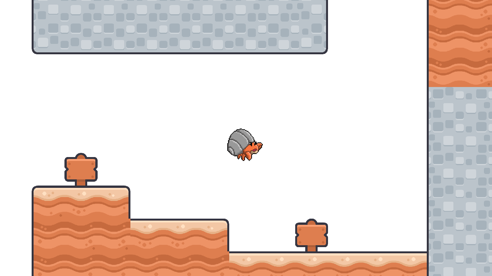
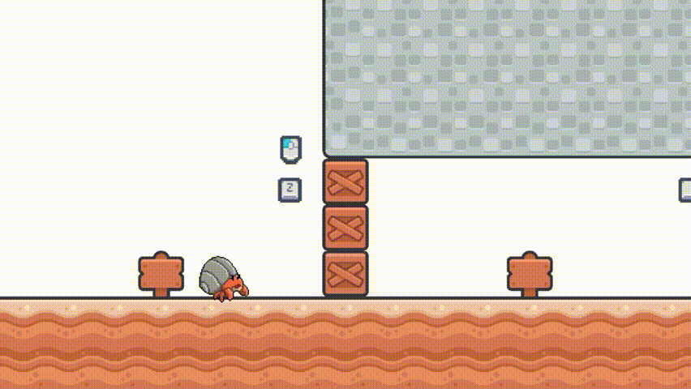
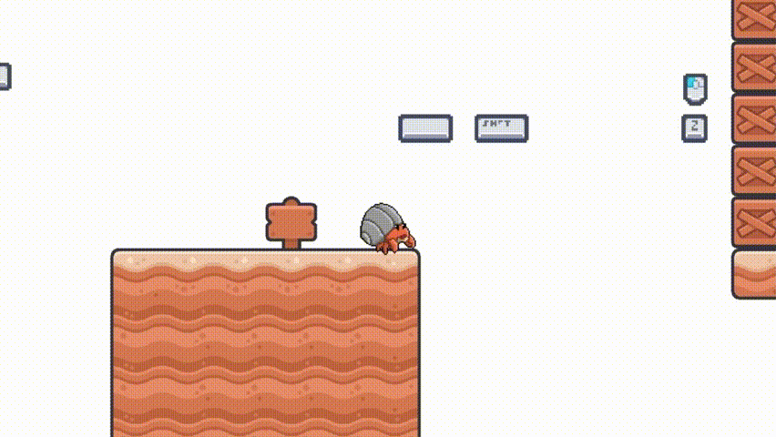
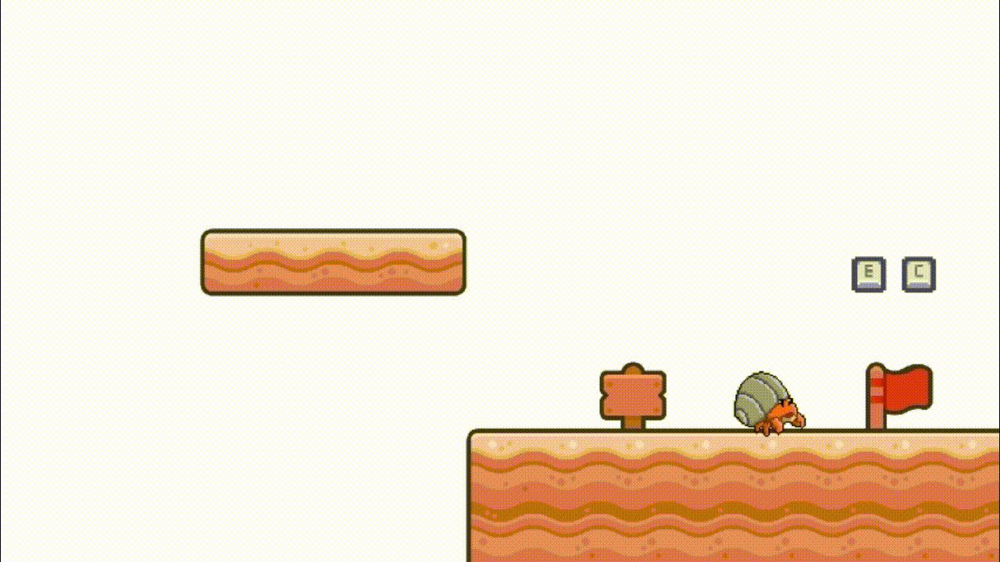

# 소라게 플랫포머

## 프로젝트 개요

이 프로젝트는 LibGDX 프레임워크와 Box2D 물리 엔진을 기반으로 개발된 2D 플랫포머 게임입니다. 플레이어의 다양한 움직임(대시, 벽 타기, 공격)을 구현했으며, JSON 기반 레벨 시스템을 통해 유연한 맵 디자인과 상호작용 가능한 오브젝트 배치가 가능하도록 설계되었습니다. 각 레벨은 게임의 조작법을 익힐 수 있도록 튜토리얼 형식으로 구성되어 있습니다.



-----

## 주요 기능

### 1. 플레이어

* **다양한 상태 및 애니메이션:** 플레이어는 `IDLE`, `WALK`, `JUMP`, `FALL`, `ATTACK`, `WALL_SLIDE`, `DASH`, `DEAD` 등 다양한 상태를 가지며, 각 상태별 애니메이션을 재생합니다.
* **물리 기반 충돌:** Box2D의 `PlayerContactListener`를 통해 발, 측면, 공격 센서 등 4가지 센서를 사용하여 지면/벽 접촉 및 공격 충돌을 감지합니다.
* **특수 동작:**
    * **벽 타기 :** 벽에 붙어 이동이 가능해지며, 플레이어 위에 스태미너 바를 시각화하여 사용 시간을 제한합니다.
    <br><br>
    * **공격:** 방향에 따른 센서를 생성하여 오브젝트 파괴를 가능하게 하며, `AttackEffect` 클래스를 통한 시각적 효과를 동반합니다.
    <br><br>
    * **대시 :** 짧은 시간동안 빠르게 이동하며, `DashEffect` 클래스를 통한 시각적 효과를 동반합니다.
    
### 2. 월드 및 레벨

* **게임 상태 머신:** `Main.java`의 `GameState` (`RUNNING`, `PAUSED`, `CLEARED`, `ENDED`, `DEAD`)를 통해 게임의 전반적인 흐름을 제어합니다.
* **JSON 기반 레벨 로딩:** `Level.java`가 `levels/*.json` 파일로부터 레벨 크기, 플레이어 시작 위치, 그리고 모든 블록 및 아이콘 데이터를 동적으로 파싱합니다.

### 3. 상호작용 및 시각 효과

* **상호작용:**
    * **`BoxObject` (상자):** 플레이어의 공격으로 파괴 가능한 오브젝트입니다.
    * **`FlagObject` (깃발):** 센서로 작동하며, 접촉 중 상호작용시 레벨 클리어(`CLEARED`) 상태로 전환되고 다음 레벨을 로드합니다.
    * **`SignObject` (표지판):** 접촉 시 사용한 한글을 띄워 메시지를 표시합니다.
* **화면 전환:**
    * **(`FadeEffect`):** **OpenGL Stencil Buffer** 기능을 활용하여 원형 페이드 아웃/인 및 전체 화면 페이드 인/아웃 효과를 구현하여 시각적 완성도를 높였습니다.
    
-----

## 문제 및 해결


### 1. 플레이어 평지 이동 및 벽 타기 시 걸림 현상

* **문제:** 플레이어 바디를 **사각형(`PolygonShape`)** 으로 설정했을 때, 평지 블록의 경계와 충돌하며 걸리는 현상이 지속적으로 발생했습니다.
    
    
* **원인:** 사각형 충돌체는 모서리가 날카로워 지형 블록의 경계에 쉽게 끼이거나, **Box2D의 충돌 계산 오차**가 발생하기 쉬웠습니다.
    
    
* **고려된 방안:** 붙어있는 지형 블록들을 하나의 큰 Box2D 바디로 병합하여 충돌 경계를 최소화하는 방법을 고려했습니다. 해당 대안은 **레벨 로딩 시스템의 재설계**가 필요하여 **높은 개발 비용**이 예상되었습니다. 


* **해결:** 플레이어 바디 충돌 형태를 **사각형**에서 상하단에 **원형 피스처(`CircleShape`)** 를 사용한 **캡슐형 충돌체**로 변경했습니다. 
        
-----

### 2. 벽 타기 중 반대 방향키 + 점프 입력 시 점프 실패

* **문제:** 벽에 붙어있는 상태에서 **벽을 등지는(반대되는) 방향키**를 누른 후 이어진 점프 입력이 벽 점프가 되지 않는 문제가 발생했습니다.
    
    
* **원인:** **반대 방향키** 입력 시 **`moveLeft()`/`moveRight()`** 메소드가 호출되고, **`isOnWall`** 이 즉시 **`false`** 로 업데이트되었습니다. 이에 따라  벽 점프 로직(**`wallJump()`**)을 호출하지 못하고 무시되는 문제가 발생했습니다.
    
    
* **해결:** **반대 방향키** 입력 시 **`wallJumpBufferTimer`** 를 짧은 시간 동안 활성화하여, 벽 타기 상태 해제 이후에도 점프 입력에 **유예 시간**을 제공했습니다.

-----

## 프로젝트 구조

### 1. Java 패키지 (core/src/main/java)

#### `io.Term_2D_Game` (Core)

| 클래스 | 역할 | 주요 기능 |
| :--- | :--- | :--- |
| **`Main.java`** | **게임 진입점 및 상태 관리** | `GameState`에 따라 `GameWorld`의 업데이트 및 렌더링을 분기 처리하고 UI를 출력합니다. |
| **`GameWorld.java`** | **물리 월드 및 객체 관리** | Box2D `World`를 생성 및 스텝 처리. `Player`, `BlockObject` 리스트, `PlayerEffect` 리스트를 관리하고 레벨 로드 및 리스타트 로직을 수행합니다. |
| **`Assets.java`** | **통합 리소스 관리** | 모든 텍스처, 애니메이션을 로드하고 관리합니다. |
| **`Level.java`** | **레벨 파싱 및 초기화** | JSON 파일로부터 레벨 데이터를 읽어와 레벨을 로드합니다. |
| **`FadeEffect.java`** | **화면 전환 효과** | Stencil 기법을 이용한 원형 페이드 효과 및 전체 화면 페이드 인/아웃을 구현합니다. |
| **`CameraManager.java`** | **게임 카메라 제어** | 플레이어를 따라다니는 카메라를 업데이트하며, 맵 경계를 벗어나지 않도록 시야를 고정합니다. |

#### `io.Term_2D_Game.Player` (플레이어 시스템)

| 클래스 | 역할 | 주요 기능                                                                                                                     |
| :--- | :--- |:--------------------------------------------------------------------------------------------------------------------------|
| **`Player.java`** | **플레이어 메인 로직** | 플레이어의 물리 이동, 애니메이션 상태 전환, 벽 타기 스태미너, 공격 및 대시 동작을 제어합니다.                                                                   |
| **`PlayerContactListener.java`** | **Box2D 충돌 처리** | `footSensor`, `leftSensor`, `rightSensor`, `attackSensor`를 사용하여 플레이어와 지형/오브젝트 간의 충돌을 감지하고 `Player` 클래스의 상태 변경 메서드를 호출합니다. |
| **`AttackEffect.java` / `DashEffect.java`** | **시각 효과** | 공격 및 대시 시점에 `GameWorld`에 추가되어 특정 `lifeTime` 동안 재생되는 애니메이션 효과를 담당합니다.                                                      |
| **`PlayerEffect.java`** | **효과 추상 클래스** | 모든 플레이어 시각 효과의 경과 시간 및 생명 주기를 관리합니다.                                                                                      |

#### `io.Term_2D_Game.Objects` (오브젝트)

| 클래스 | 역할 | 주요 기능                                                |
| :--- | :--- |:-----------------------------------------------------|
| **`BlockObject.java`** | **모든 오브젝트의 기본 추상 클래스** | 모든 블록의 공통 변수 및 Box2D Body 생성 로직을 포함합니다.              |
| **`BoxObject.java`** | **파괴 가능한 상자** | 플레이어의 공격과 상호작용하여 Box2D 월드에서 Body가 제거(파괴)됩니다.         |
| **`FlagObject.java`** | **레벨 클리어 지점** | 센서(Sensor) 타입으로 설정되어 플레이어와 접촉 시 `CLEARED` 상태로 전환됩니다. |
| **`SandObject.java`** | **지형 블록** | 레벨 구성을 위한 정적(Static) 물리 바디를 가진 기본 지형 블록입니다.          |
| **`StoneObject.java`** | **지형 블록** | 레벨 구성을 위한 정적(Static) 물리 바디를 가진 벽타기가 가능한 지형 블록입니다.    |
| **`SignObject.java`** | **정보 표지판** | 센서로 작동하며, `message` 필드를 출력하는 상호작용 오브젝트입니다.           |

### 2. 리소스 폴더 (assets)

| 폴더 | 역할 |
| :--- | :--- | 
| **`/levels`** | 게임 레벨의 구조, 블록 배치, 플레이어 시작 위치가 정의된 JSON 파일 |
| **`/player`** | `player_walk.png`, `player_attack.png` 등 플레이어 애니메이션 스프라이트 시트 |
| **`/objects`** | `sand_block.png`, `flag_red_a.png` 등 지형 및 사물 텍스처 |
| **`/fonts`** | `Galmuri14.ttf` 등 게임 내 UI 및 표지판 메시지에 사용되는 폰트 파일 |
| **`/inputs`** | 조작법 안내 등에 사용되는 아이콘 텍스처 |

-----

## 설치 및 실행 방법

1.  **프로젝트 클론:**
    터미널을 열고 원하는 위치에서 다음 명령어를 실행하여 프로젝트를 클론합니다.
    ```bash
    git clone https://github.com/Cha0910/Game_and_eXtended_Reality_2D.git
    ```
2.  **Gradle 실행:**
    프로젝트의 루트 디렉토리에서 다음 명령어를 실행하여 데스크톱 버전을 빌드하고 실행합니다.
    ```bash
    gradlew.bat lwjgl3:run
    ```

-----

## 기술 스택

* **프레임워크:** LibGDX (with Box2D extension)
* **개발 언어:** Java
* **물리 엔진:** Box2D

-----
